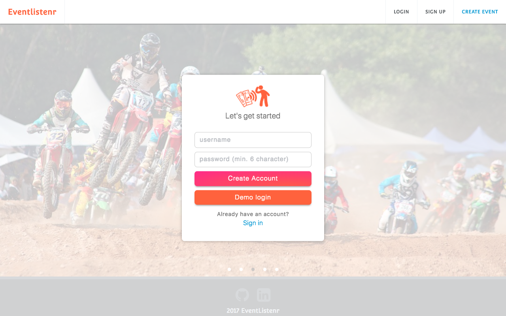

# Eventlistenr

[Eventlistenr Live](https://eventlistenr.herokuapp.com/)

[Eventlistenr Live 2](https://eventlistenr1.herokuapp.com/)

Eventlistenr is a single-page web application platform inspired by Eventbrite, enabling users to create secure accounts, host, bookmark, and register for events.

## Technologies
Built using Ruby on Rails MVC framework for the back-end API layer with PostgreSQL, and React with Redux for the front-end UI layer.

## Features and Implementation
* Secure user accounts, using front-end and back-end user authentication using BCrypt
* User has the ability to create events
* User can bookmark/unbookmark events
* User can purchase tickets to events
* User Dashboard displays purchased tickets and bookmarked events.

### Home Page

### User Login/Signup format

### Event Show Page

### Create Events

User can create events. User created events immediately show on the home page. Images can be uploaded via drag and drop feature using React Dropzone.

### Bookmarking Events
User can bookmark/unbookmark events. Bookmarked events are shown on the User Dashboard.

### Registering/Ticketing Events

User can "register" to events by "purchasing" tickets to events.
Events with purchased tickets appear on the User Dashboard.

### User Dashboard

## Additional Resources
* [View Wireframes](https://github.com/gevuong/EventListenr/tree/master/docs/wireframes)
* [React Component Hierarchy](https://github.com/gevuong/EventListenr/blob/master/docs/component_hierarchy.md)
* [API endpoints](https://github.com/gevuong/EventListenr/blob/master/docs/api-endpoints.md)
* [DB schema](https://github.com/gevuong/EventListenr/blob/master/docs/schema.md)
* [Sample State](https://github.com/gevuong/EventListenr/blob/master/docs/sample-state.md)

## Future Direction
I plan to incorporate additional features to this application, such as the following:
* Incorporating categories
* Modifying Created Events
Allow user to edit and delete created event
* Google Maps
Interactive map showing the event's location on the event show page
Interactive map showing multiple events on search results page
* Search
Autocomplete search feature allows users to search for events by category or by event name
