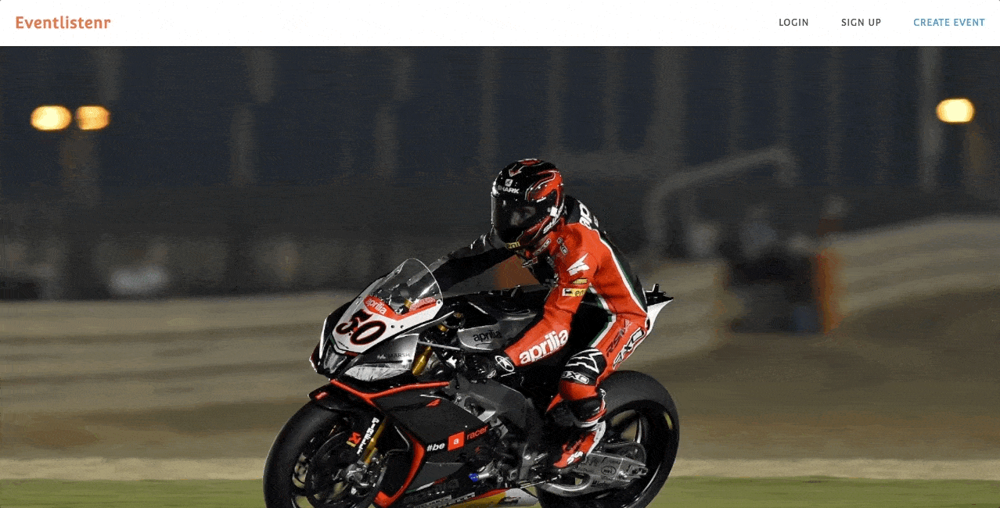
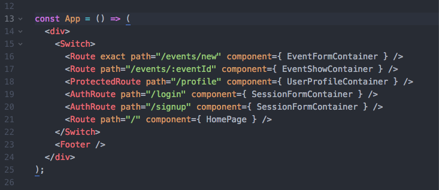
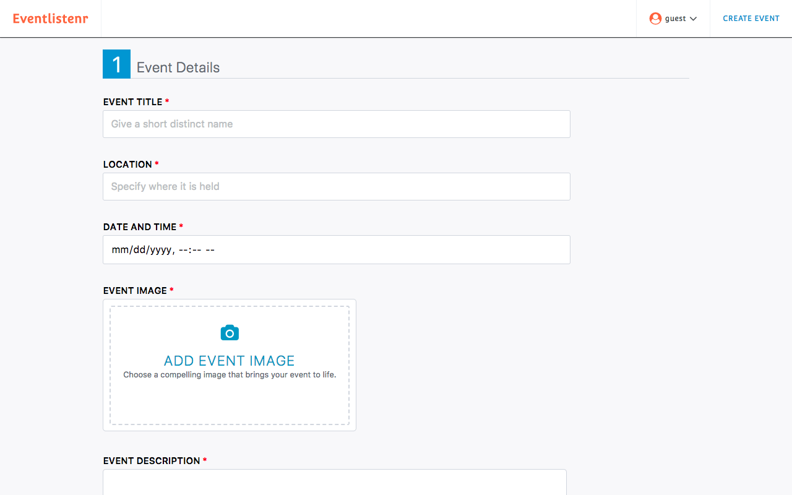
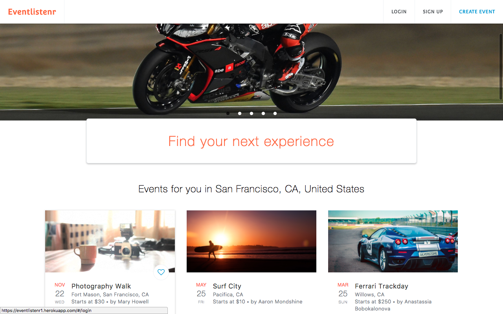
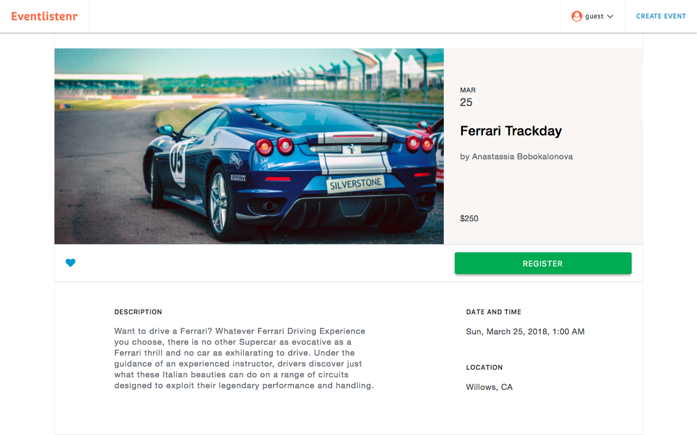
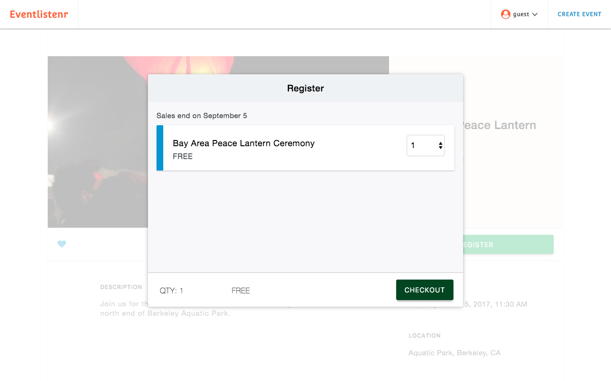
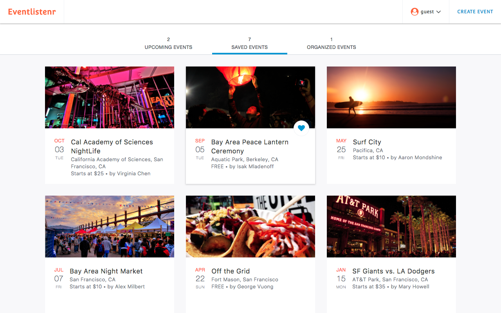

# Eventlistenr

[Eventlistenr Live](https://eventlistenr.herokuapp.com/)

[Eventlistenr Live 2](https://eventlistenr1.herokuapp.com/)

Eventlistenr is a single-page web application inspired by Eventbrite. The platform enables users to create secure accounts, host, bookmark, and register to events.

## Technologies
Built using Ruby on Rails MVC framework for the back-end API layer with PostgreSQL, and React with Redux for the front-end UI layer.

## Notable Features and Implementation
### User Login/Signup format
* Secure user accounts with front-end user authentication using BCrypt

* Implemented `AuthRoute` to ensure user cannot visit `/#/login` and `/#/signup` if user is already signed in, and a `ProtectedRoute` to redirect user to the `/#/login` page if user wants to perform an action (i.e. create, bookmark, or register to an event) that requires the user to login. Both routes are then mapped as props to allow other React components to access it.

### Create Events

* User has the ability to create events
User can create events. User created events immediately show on the home page. Images can be uploaded via drag and drop feature using React Dropzone.
* Technical Challenge: Dropzone

### Home Page

### Event Show Page

### Bookmarking Events
* User can bookmark/unbookmark events. Bookmarked events are shown on the User Dashboard.

### Registering/Ticketing Events
User can register to events.

Registered events appear on the User Dashboard.
* User can purchase tickets to events.

### User Dashboard
* Displays registered, bookmarked, and organized events.

## Additional Resources
* [View Wireframes](https://github.com/gevuong/EventListenr/tree/master/docs/wireframes)
* [React Component Hierarchy](https://github.com/gevuong/EventListenr/blob/master/docs/component_hierarchy.md)
* [API endpoints](https://github.com/gevuong/EventListenr/blob/master/docs/api-endpoints.md)
* [DB schema](https://github.com/gevuong/EventListenr/blob/master/docs/schema.md)
* [Sample State](https://github.com/gevuong/EventListenr/blob/master/docs/sample-state.md)

## Future Direction
I plan to incorporate additional features to this application, such as the following:
* Incorporating categories
* Modifying Created Events
Allow user to edit and delete created event
* Google Maps
Interactive map showing the event's location on the event show page
Interactive map showing multiple events on search results page
* Search
Autocomplete search feature allows users to search for events by category or by event name
